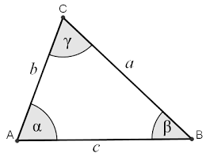

# Slider Crank
Unity package for simplified representation of slider crank mechanism.


## Install Package
With the native [Unity Package Manager](https://docs.unity3d.com/Manual/upm-ui-giturl.html), you can add `https://github.com/Preliy/SliderCrank.git#upm` via the Git URL or modify the `Packages/manifest.json` file directly.

```json
{
    "dependencies": {
        "com.preliy.slider-crank": "https://github.com/Preliy/SliderCrank.git#upm"
    }
}
```

## Components

### SliderCrank
Add the `SliderCrank.cs` component to a GameObject. The transform of the GameObject represents the slider axis, and the slider moves along the Z-axis.


#### Parameters
- **Length** - The length between the wheel pin and the sliding pin (clamped to >= 0)
- **Use Negative Solution** - When enabled, uses the negative solution for the slider position calculation

#### References
- **Pin** - Transform reference to the pin (wheel pin)
- **Slider** - Transform reference to the slider

#### Settings
- **Update Type** - Select when to perform the calculation:
  - `Update` - Calculates in `Update()` loop
  - `FixedUpdate` - Calculates in `FixedUpdate()` loop
  - `LateUpdate` - Calculates in `LateUpdate()` loop
- **Execute in Editor** - When enabled, calculations are executed in the editor and the slider position is updated
- **Show Gizmos** - Displays visualization gizmos in the Scene view

---

### MoveCrank
Add the `MoveCrank.cs` component to a GameObject to control crank movement using triangle geometry calculations.




#### Parameters
- **Length AC** - The length of side AC in the triangle formed by points A, B, and C

#### Control
- **Execute** - When enabled, the component actively updates the crank position

#### References
- **Flip Side** - When enabled, flips the angle calculation to the opposite side
- **A** - Transform reference to point A
- **B** - Transform reference to point B
- **C** - Transform reference to point C (this is the point that gets repositioned)

#### Gizmos
- **Show Gizmos** - Displays visualization gizmos in the Scene view:
  - Red spheres at points A, B, and C
  - Cyan line from A to B and B to C
  - Yellow line from C to A
  - Cyan wire disc showing the rotation arc around point B

#### Notes
- The component uses the law of cosines to calculate triangle angles
- It validates triangle inequality to ensure valid triangle geometry
- Point C is repositioned based on the calculated angle at point B
- Rotation is performed around the transform's right axis

---

## Demo
In `Samples/Demo` you can find a demo scene with examples of both components in action.


